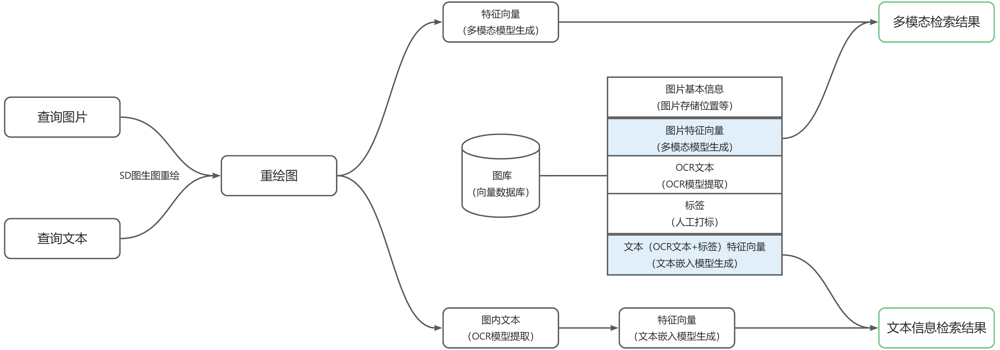

<h1 id="iVZ0e">概述</h1>
本工具是使用Python开发的图文搜图工具。

亮点：支持**图文融合搜图**，以及**大模型辅助搜图**！另外，也支持常规的纯文本搜图（多模态和OCR兼备）和以图搜图（也包括使用图片内的文本来搜图）。

注意：当前该项目需要您自行搭建环境，按照文档说明手动部署。

<h1 id="yEShf">基本原理</h1>

<h2 id="kHKiY">纯文本搜图</h2>

+ **多模态检索**
  - 通过多模态模型，将查询文本转换为可以直接于图片特征向量相比较的文本特征向量。该特征向量在向量数据库中与预先计算出的所有图片的特征向量进行相似度计算后，取出相似度最高的图片作为“多模态检索结果”。
+ **文本信息检索**
  - 通过文本嵌入模型，将查询文本转换为文本特征向量。该特征向量在向量数据库中与所有图片对应的文本信息（OCR文本和人工打标的标签）特征向量进行相似度计算后，取出相似度最高的图片作为“文本信息检索结果”。


<h2 id="paWIs">以图搜图</h2>

+ **多模态检索**
  - 通过多模态模型，将查询图片转换为特征向量。该特征向量在向量数据库中与预先计算出的所有图片的特征向量进行相似度计算后，取出相似度最高的图片作为“多模态检索结果”。
+ **文本信息检索**
  - 通过OCR模型，将查询图片中的文本提取出来；再通过文本嵌入模型，将OCR提取文本转换为文本特征向量。该特征向量在向量数据库中与所有图片对应的文本信息（OCR文本和人工打标的标签）特征向量进行相似度计算后，取出相似度最高的图片作为“文本信息检索结果”。


<h2 id="SmOyy">图文融合搜图</h2>

+ 首先，将查询图片和查询文本输入给Stable Diffusion图生图工具，图生图工具会基于查询文本对查询图片进行重绘，获得重绘图；
+ 对重绘图执行以图搜图流程，获得多模态检索结果和文本信息检索结果。



<h2 id="GsYWz">大模型辅助搜图</h2>

+ 该项目为LLM提供了纯文本搜图、以图搜图和图文融合搜图工具。LLM是多模态模型，可以基于您的提示词和输入图片来选择性的调用上述3种工具。
+ 为LLM撰写了要求LLM根据用户自然语言生成SD兼容提示词的系统提示词规则，尽量确保用户在图文融合搜图时，查询文本能够较为准确地转换为SD图生图工具所需的提示词。
+ 由于未对LLM做过多限制，理论上也可以支持比如“传入多张图，由LLM总结特征后用文本搜图/图文融合搜图”等更高级功能。

<h1 id="iCrDa">使用准备</h1>
该项目尚未提供一键部署包，因此需要您在使用前需要完成以下工作：

+ 硬件准备：
  - 显存>=6GB的NVIDIA显卡，且为能够运行transformers库的架构。
  - 内存>=32GB
+ Postgresql数据库准备
  - 在本地或云上部署Postgresql，且安装了pgvector插件；
  - 根据.env-sample中的提示填写数据库相关信息，并更名为.env；
  - 根据.env中POSTGRESQL_DB的配置（假设配置为aidb），在Postgresql中建立对应的数据库。建立schema=dev，table=tb_image_info，并为tb_image_info表启用pgvector插件；
  - 建立表结构，并赋权：

```sql
create table if not exists dev.tb_image_info
(
    id                serial
      constraint tb_image_info_pk
            primary key,
    gmt_create        timestamp,
    gmt_modified      timestamp,
    file_gmt_modified timestamp,
    file_path         varchar(1000),
    file_name         varchar(1000),
    file_sha256       varchar(128),
    ocr_text          text,
    tag_text          text,
    image_vector      vector(1024),
    all_text_vector   vector(1024)
);
create index if not exists tb_image_info_file_path_index
  on dev.tb_image_info (file_path);
create index if not exists tb_image_info_file_sha256_index
  on dev.tb_image_info (file_sha256);

alter table dev.tb_image_info
  owner to aidbuser; --user1需要替换为.env中POSTGRESQL_USER的配置
```

+ AI模型/工具准备
  - 自行下载百度PP-OCRv5_server模型到resources/ai-models目录，详见PaddleOCR官网以及本项目的src/app/ai/paddle_ocr_util.py文件
  - 在本地或云上部署LM Studio，加载了**支持工具的多模态模型**（如Gemma3），并且启动了服务器。
  - 根据.env-sample中的提示填写.env文件中LM Studio相关信息；
  - 在本地或云上部署Stable Diffusion WebUI，并且启动了服务器。
  - 根据.env-sample中的提示填写.env文件中SD相关信息；
+ 图库准备
  - 【可选步骤，非必须】将您希望被检索的图片复制到resources/dataset目录下，运行scripts/dataset_rename.py，可将图片文件全部进行校验并重命名。非图片文件和重复文件可以选择移动到其他目录中。具体行为可以参考该脚本的注释。
  - 根据.env-sample中的提示填写.env文件中SCAN_PATHS字段，该字段下所有目录中的图片文件将通过您**手工按顺序执行**以下步骤逐步加载到图库数据库中：
    1. 执行run_init_db.py，将SCAN_PATHS所指定的所有目录（包括子目录）的所有图片文件基本信息载入数据库中；
    2. 执行run_init_image_vector.py，为数据库中所有图片生成图片特征向量；
    3. 执行run_init_ocr_text.py，为数据库中所有图片通过OCR提取文字信息；
    4. 执行run_init_all_text_vector.py，为数据库中所有图片的文字信息生成文本特征向量。
    5. 【可选步骤，非必须】执行run_delete_incomplete_entries.py，将上述步骤中出现异常未全部准备好的图片从数据库中删除。

在完成上述准备后，后续只需执行run.py，即可启动图文搜图工具。

+ 如果向dataset目录中新增图片，需要重新执行“图库准备”所有步骤。但是需要您自行修改这些脚本中的某些开关，来避免将整个数据库重新刷新，否则将非常耗时。


